# Powering TU Dublin: SDG 7: Affordable & Clean Energy

Name: Noel McCarthy

Student Number: C22533826

Class Group: TU856/Y4

Github: https://github.com/NQ-TU 

# Video

[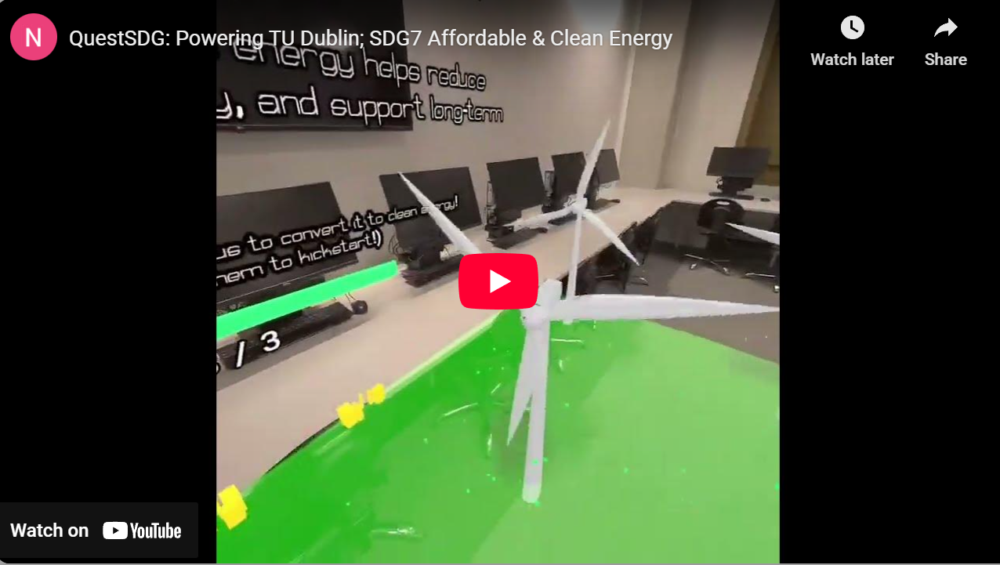](https://youtu.be/YNKCAHKQkNk)

# Screenshots

Attaching some screenshots of application in progress and main asset scenes.

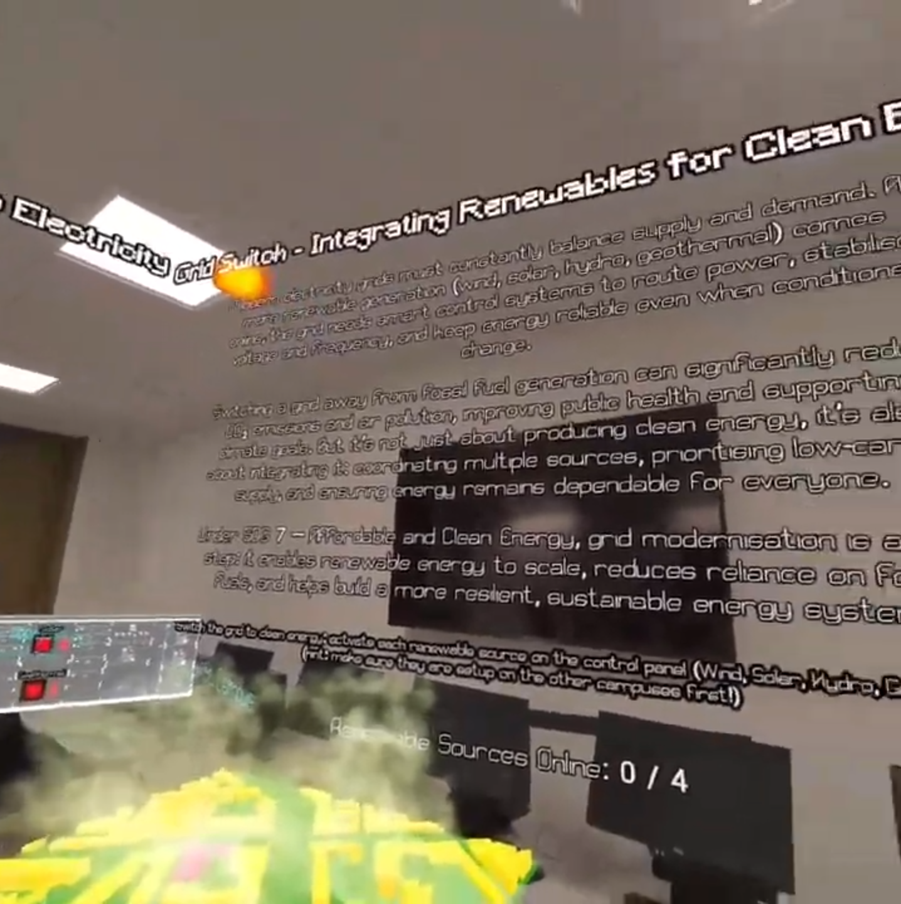

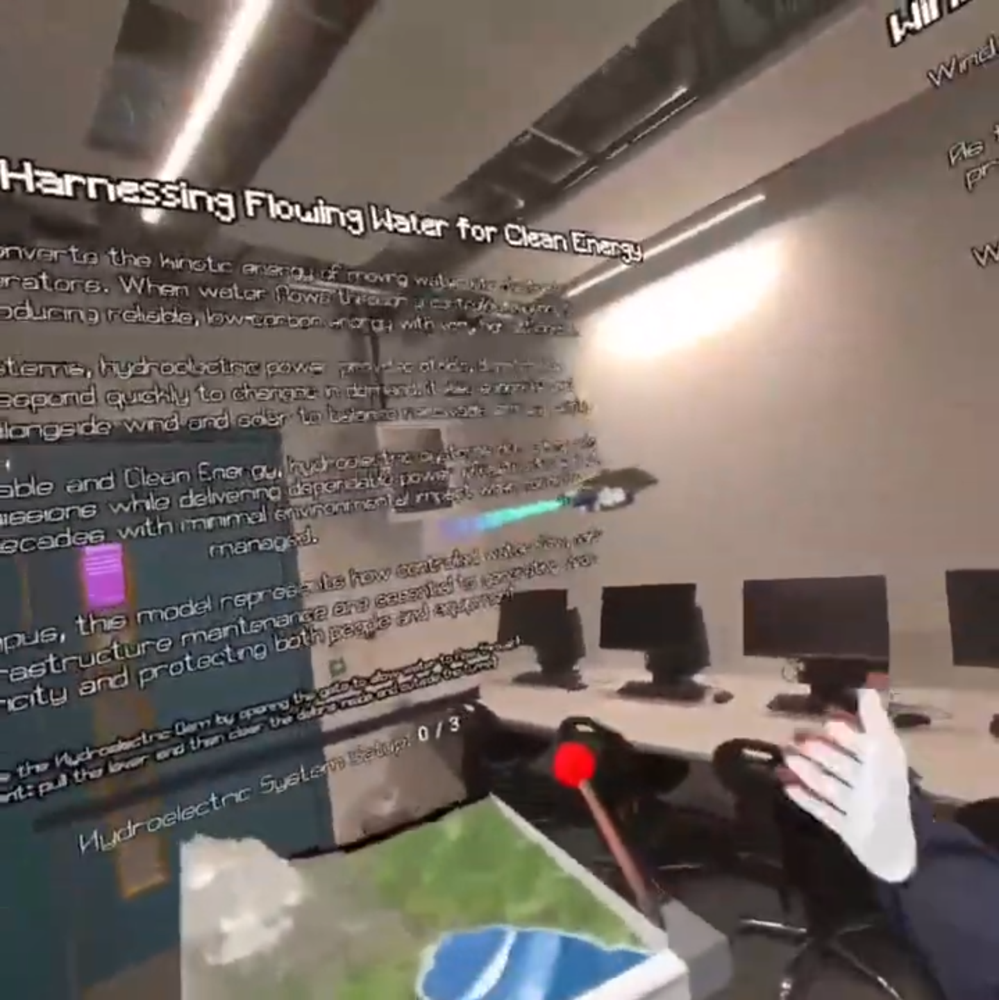

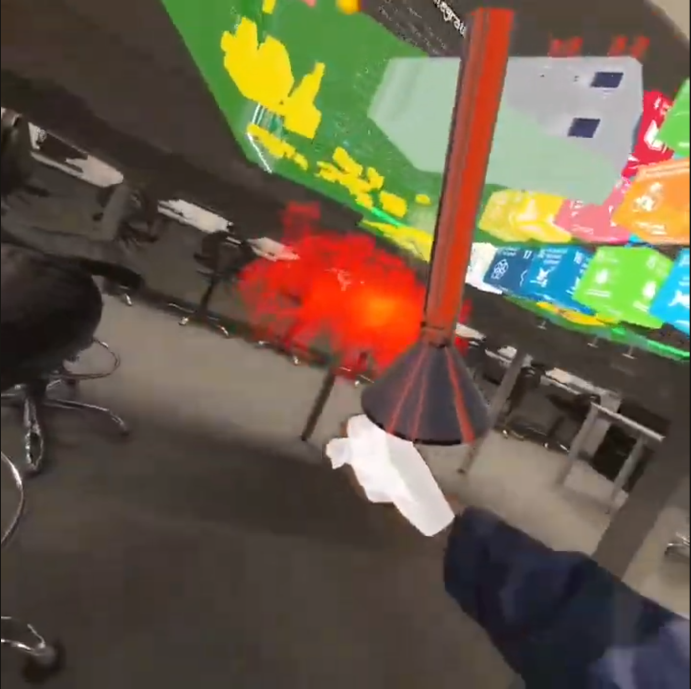

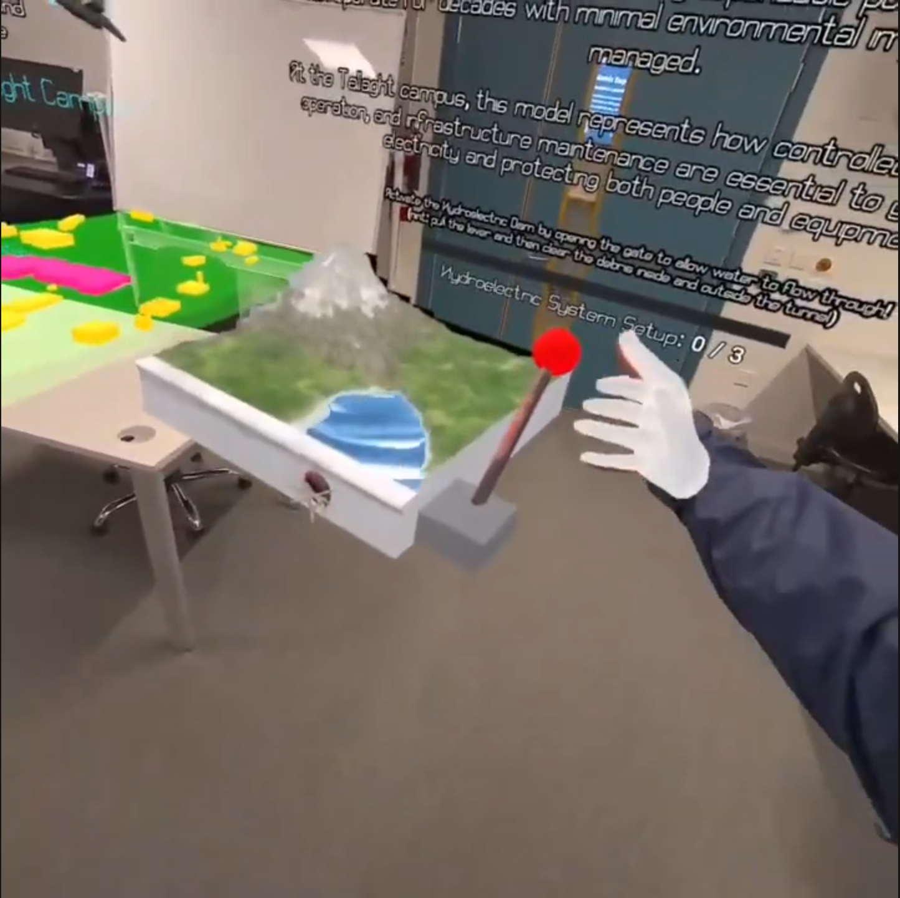

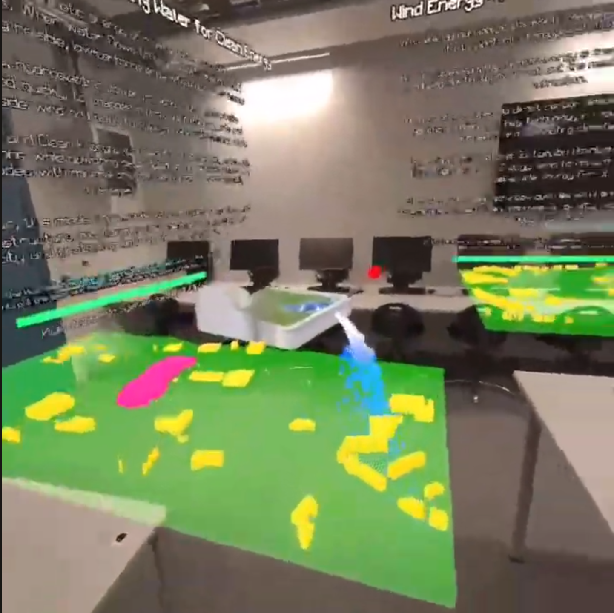

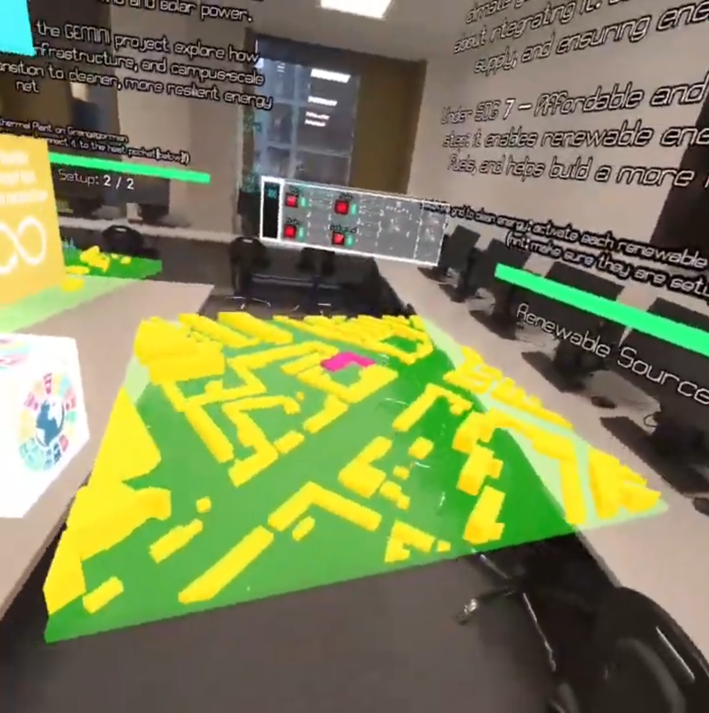

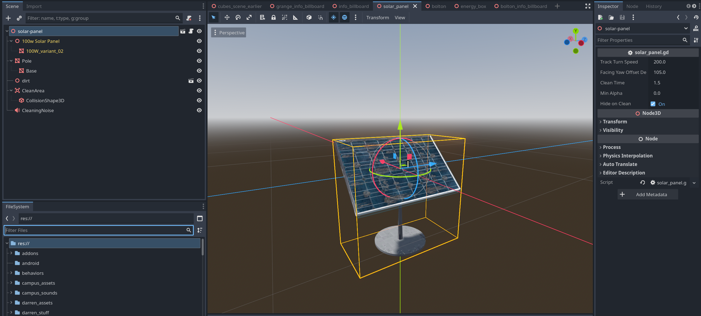

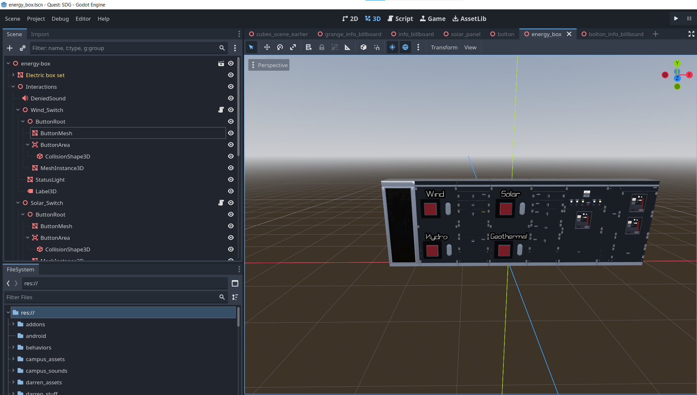

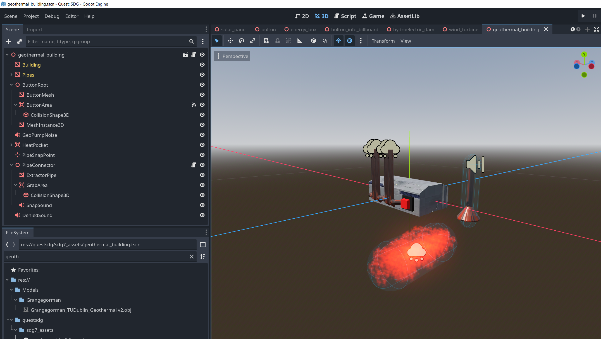

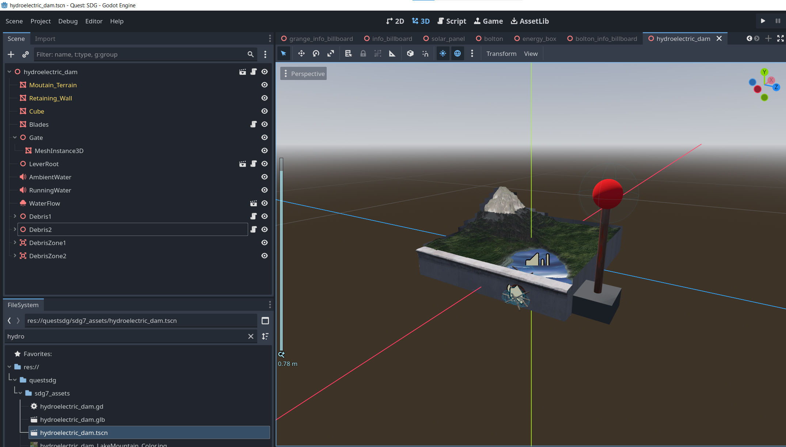

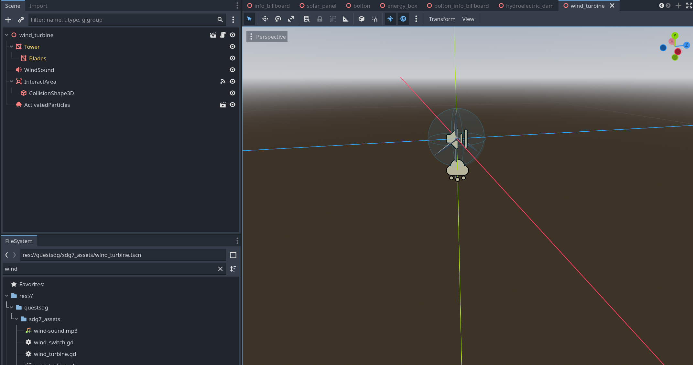

# Description of the project

This project is an interactive, multi-campus experience built in Godot that demonstrates Sustainable Development Goal 7 (Affordable and Clean Energy) through hands on renewable energy interactions. Users explore different campus locations, each representing a renewable energy system (wind, solar, hydroelectric, and geothermal), and complete tasks that activate those systems.

Each renewable source is represented by an interactive 3D asset with visual, audio, and particle feedback. A central progression system tracks user actions across all campuses and updates in world billboards to reflect progress. The project is designed to be exploratory and educational, allowing users to learn about clean energy concepts through direct interaction rather than passive instruction.

It is an extension of QuestSDG, https://github.com/skooter500/questsdg.

# Instructions for use

1. From startup, navigate to the colour wheel and select SDG 7 using the thumbs-up interaction to spawn the SDG 7 content.

2. Once SDG 7 is active, walk to each campus location and read the SDG 7 billboard to understand the task associated with that renewable energy source.

3. Complete the interaction at each campus:

- Activate wind turbines

- Clean and activate solar panels

- Clear debris and operate the hydroelectric dam

- Connect and activate the geothermal system

4. Visual feedback, particles, audio cues, and progress bars will update as each task is completed.

5. User can return to base project state by selecting the color wheel and using the thumbs up gesture.

# How it works:

The system is built around a central manager script that spawns and despawns renewable energy assets and billboards when SDG 7 is selected. Each interactive object emits signals when actions are completed (e.g. activated, cleaned, or connected). These signals are captured by the manager, which updates internal progression state and drives visual feedback such as billboard progress bars, particle effects, fog clearing, and completion sounds.

Each campus operates independently but follows a shared progression interface, allowing the same billboard and tracking logic to be reused across different renewable systems. This modular design makes the system easy to extend while keeping all campuses synchronised under a single SDG progression flow

# List of classes/assets in the project

The SDG7 implementation introduced over 140 new files, including scripts, scenes, models, materials, particle systems, and audio assets. Due to the scale of the project, assets are grouped by system rather than listed individually. Screenshots below show the SDG7 asset folder structure and associated scripts.

The primary systems implemented include wind turbines, a geothermal building (with lever, button, and pipe-connection logic), a hydroelectric dam, a central energy box, and solar panels with a sun-orbit system. Each energy-box button shares the same underlying logic but is implemented as separate scripts to support modular interaction and independent unlocking.

The central sdg7_manager.gd script coordinates spawning, progression tracking, billboard updates, particle effects, fog control, and audio feedback across all campuses. Minor supporting changes were also made to existing scripts (e.g. hand.gd) to integrate XR interactions cleanly with the SDG7 systems.
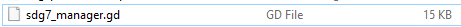

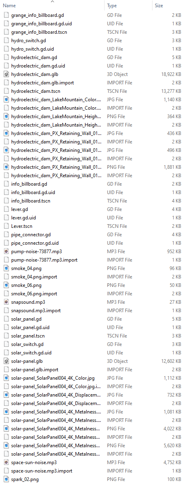
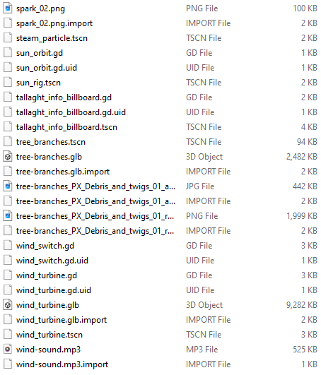

| Class/asset | Source |
|-----------|-----------|
| sdg7_manager.gd | Self written |
| info_billboard.gd | Self written |
| aungier_info_billboard.gd | Self written |
| tallaght_info_billboard.gd | Self written |
| grange_info_billboard.gd | Self written |
| bolton_info_billboard.gd | Self written |
| wind_turbine.gd / blades.gd / wind_switch.gd | Self written |
| solar_panel.gd / solar_switch.gd / sun_orbit.gd | Self written |
| hydroelectric_dam.gd / hydro_switch.gd / lever.gd / debris_grab.gd | Self written |
| geothermal_building.gd / geo_switch.gd / pipe connector logic | Self written |
| energy_box.tscn / energy box switch scripts | Self written |
| hand.gd (XR interactions) | Self written |
| Particle systems (steam, wind, dust) | Self written |
| Audio assets (environmental sounds, completion chimes) | sourced/modified |

# What I am most proud of in the assignment

I'm most proud of delivering a progression system with user interaction for each campus that aligns with SDG7. I ran into a lot of problems when beginning, figuring out how signals work, materials, particles, navigating the existing projects scenes/code structure, how best to compartamentalise the SDG7 functionality from the base projects code, and honestly using Godot properly, the engine is really powerful and has a lot of features that I had no experience with using as I had never touched a game engine before this project. 

It's really simple but I love how I implemented the Windmill assets, as they were the first to be implemented they took me the most amount of time, hours in blender (should have downloaded an asset!), the core framework for the spawning & despawning assets system was built from this which I reused for the rest of the project (you can see in each merge request sdg7_manager.gd growing incrementally as we implemented more assets). The progression for this system was really simple, easy to understand, and probably the most aligned with what it does (you push air through the windmill, and it speeds up! amazing...), some nice particles float around to indicate you activated them too with spatial audio and completion chime. 

# What I learned

I learned how to effectively use the Godot game engine as a structured platform rather than just a visual editor, learning about scene hiararchies, node ownership, transforms and how to design resuable scenes that could be spawned and despawned dynamically accross different scenes. Equally I spent a lot of hrs in Blender, becoming more efficient at creating assets and I feel confident I know how to create whatever asset I need (given the time..).

I worked with signals and event driven logic a lot in this project, connecting interactive objects (wind tubines, solar panels, hydrodam, geothermal plant, etc.) to a central manager script that tracked SDG7s progression end to end. There were 4 primary tracked tasks, each with subtasks all realeted to a renewable energy type that had sounds, particles, material changes etc all applied based on signals. This really reinforced good coding practices and the importance of clean, reusable interfaces for components (e.g, the billboards all work practically the same), and state management to coordinate the many independent systems. 

I leanred how to create interactive components such as buttons, levers, implemented XR interactions like grabbing and snapping alongside input state management. Debugging these sent me on massive rabit holes, but also reinforced some smaller core learnings like node paths, signal wiring, transform/scale offsets etc. 

Again, my debugging, problem solving skills, and general development workflow i feel improved, I spent a lot of time initially understanding the main project before implementing my first bit of functionality which was in the 'feature/sdg7-core', and because of that I did not have to change or deviate from that core setup (couple dozen lines of code to over 6k), only adding additional functionality in later feature and update branches. 

# Proposal submitted earlier can go here:

I made some alterations on my final version compared to the proposal, primarily the campus wide effects changing, however small interaction changes too while developing the project that were more suited to the XR enviornment.

# Powering TU Dublin: SDG 7: Affordable & Clean Energy
| Name | Student Number |
|-----------|-----------|
| *Noel McCarthy* | *C22533826* |

## Project Proposal & Overview

**Powering TU Dublin** is an interactive XR extension of the [Quest:SDG](https://github.com/skooter500/questsdg) project. The project aims to transform the SDG7 Cube into a tactile learning experience, allowing users to physically explore and setup renewable energy sources to power the TU Dublin campuses. 
I picked SDG7 as I wanted to visualise the infrastructure behind different types of renewable energy sources, and how each campus aligns with a different type of energy source. 

When the **SDG 7 cube** is selected, five renewable energy installations appear around the campuses each requiring setup. 
There will be a guide on what to do for each site, alongside information related to that source of energy.
Every activation triggers visuals and audio:

| Campus | Renewable Energy | Description | Feedback |
|---------|------------------|--------------|-----------|
| **Grangegorman** | 🌡️ **Geothermal** | Grangegorman is home to the GEMINI geothermal borehole project. | Press a heat pump node; orange thermal light rises from vents. A soft ambient heatwave effect radiates from the campus. |
| **Blanchardstown** | 🌬️ **Wind Energy** | Situated on the outskirts of Dublin, with open surroundings suitable for wind farms. | User interacts with a lever, the further it is moved the more intense wind turbine blades spin with gust particle effects. A whooshing wind sound plays as Blanchardstown glows with a blue hue. |
| **Tallaght** | 💧 **Hydroelectric/Water Energy** | Near the foothills of the Dublin mountains we can link water and rivers. | Press a button; a dam opens up with ripple particles and water sounds. Tallaght glows cyan-blue. |
| **Aungier Street** | ☀️ **Solar Energy** | City center based campus, limited on space but so take advantage of roof space. | User “aims sunlight” beam toward solar panels. Panels glow golden, and a soft solar hum plays as campus lights up. |
| **Bolton Street** | 🔋 **Energy Storage/Electric Grid** | Engineering campus, symbol of energy efficiency and innovation. | An electricity tower stands and the user must connect it to a battery bank to power lights around the campus. Electric sparks shoot from tower, batteries glow. |

---

## Key Features & Interactions
- **Core Interaction:** walk to each renewable installation → interact with energy source -> distinct **visual/audio feedback** per energy source.  
- **Dynamic lighting** to illuminate linked campuses.  
- **Resettable scene** for repeat demonstrations.  

---

## XR Technologies
- **Hand Tracking 2.0** for tactile button activation.  
- **Passthrough AR** (Quest 3) for blending virtual and real spaces.  
- **Spatial Audio** for local feedback (wind, water, solar hum).  
- **Particle Systems** for wind gusts, sunlight beams, and water ripples.  
- **Dynamic Lighting** for campus illumination.  

---

## Sketches 
Here I have 6 sketches, 5 of what I expect to develop for energy source installations, and 1 example of the spatial layout including the interaction. very rudimentary and the expected interactions. 

Grangegorman & Blanchardstown

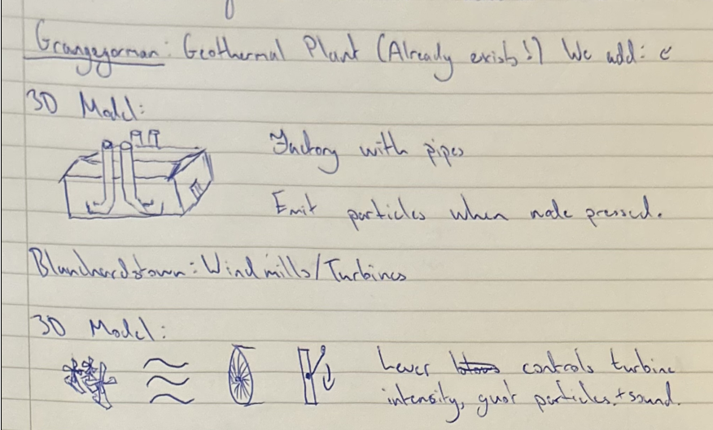

Tallaght, Aungier st, & Bolton St

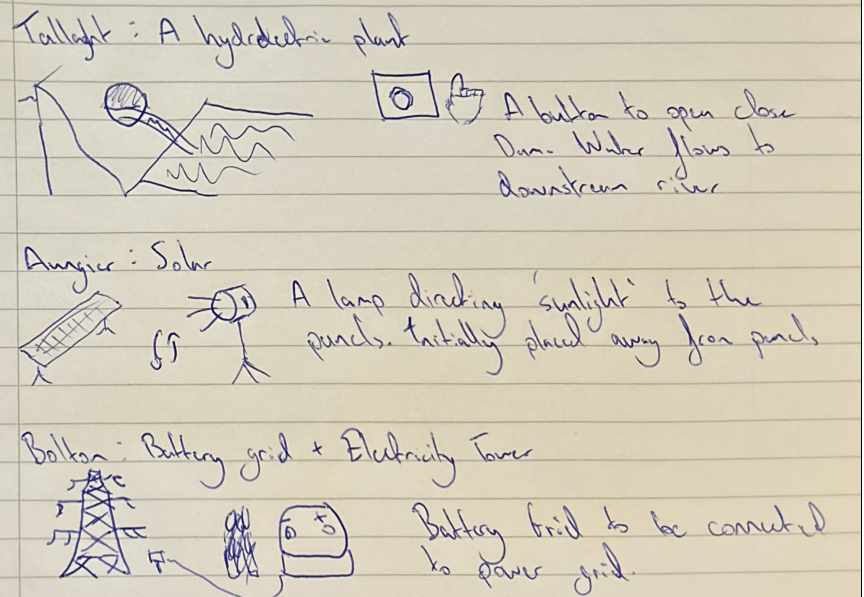

Spatial example, this is how i expect the models to exist in godot. Each installation will be located next to the campus, meaning the user needs to walk over, and then interact with it. 

