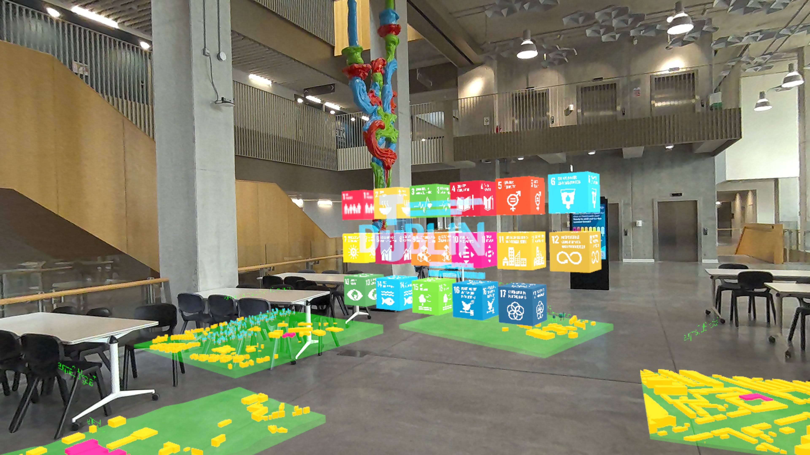
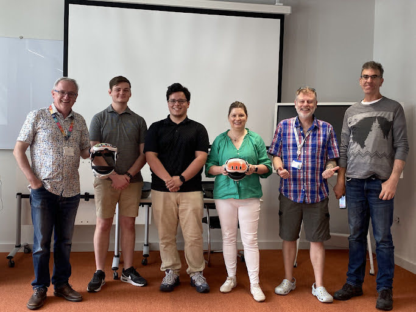
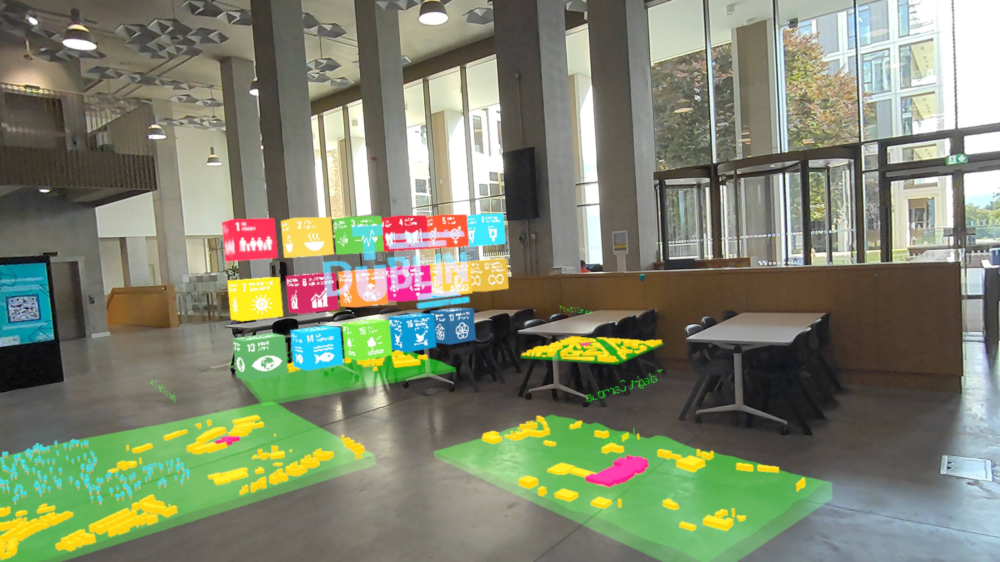
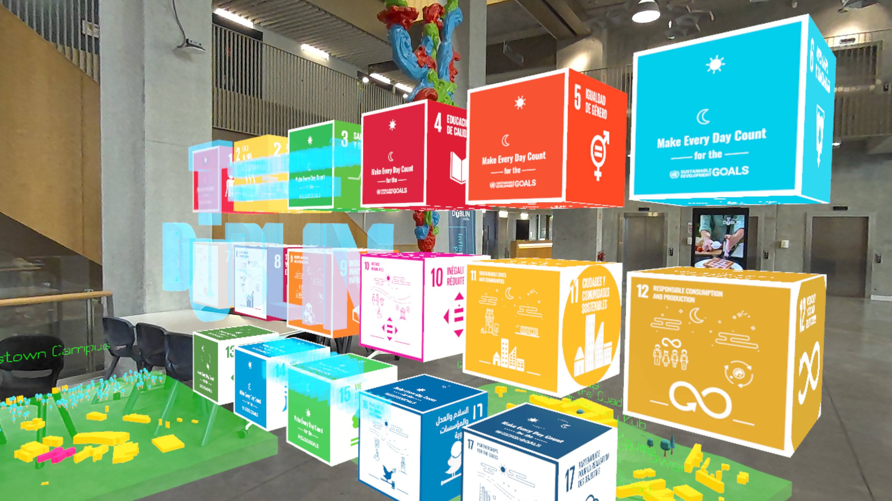
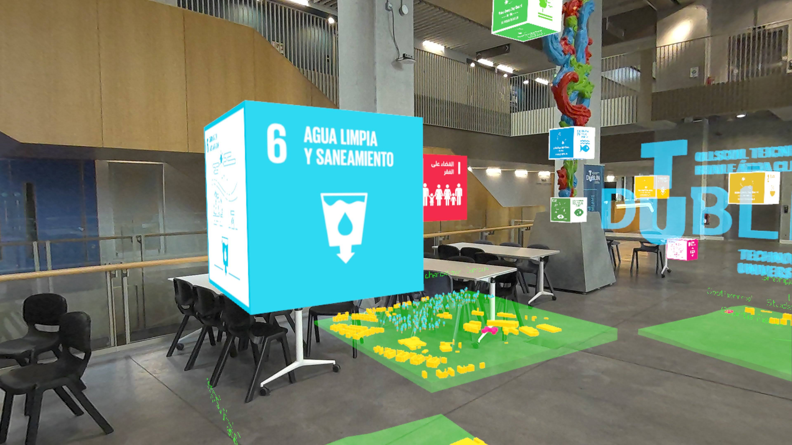
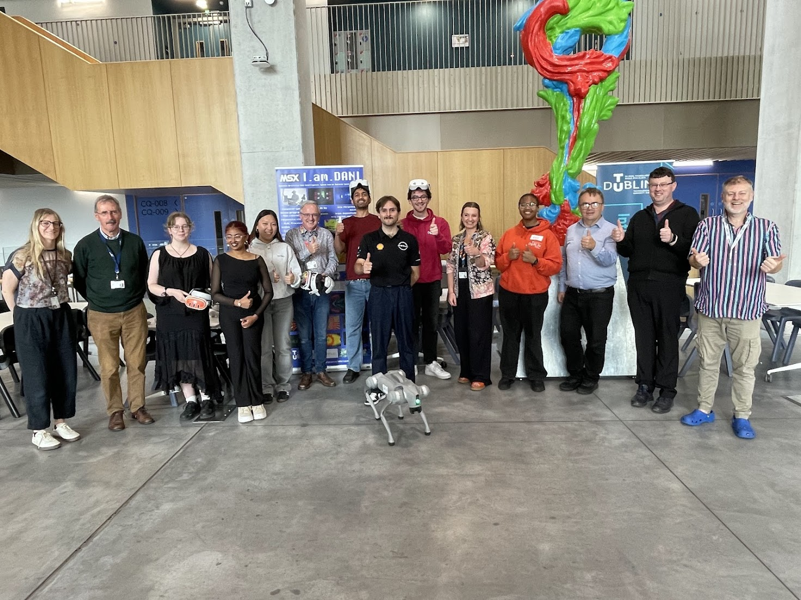

# Quest: SDG

An immersive experience where you can learn about the UN SDG Goals and TU Dublin projects that support the SDG's. 

- Created in Godot
- Runs on Quest 3 and Quest 3S

1. No Poverty 
2. Zero Hunger 
3. Good Health and Well-Being 
4. Quality Education 
5. Gender Equality 
6. Clean Water and Sanitation 
7. Affordable and Clean Energy 
8. Decent Work and Economic Growth 
9. Industry, Innovation and Infrastructure 
10. Reduced Inequalities 
11. Sustainable Cities and Communities 
12. Responsible Consumption and Production 
13. Climate Action 
14. Life Below Water 
15. Life on Land 
16. Peace, Justice and Strong Institutions 

## Created By:

### Faculty of Digital and Data

- Dr Bryan Duggan
- Darren Fitzpatrick
- Garrett Recker
- Mateo Alves

### TU Dublin Sustainability Office

- Dr Brian Gormley
- Olivia Freeman
- Paul Duffy
- Lucia Walsh
- Kenneth Boyle